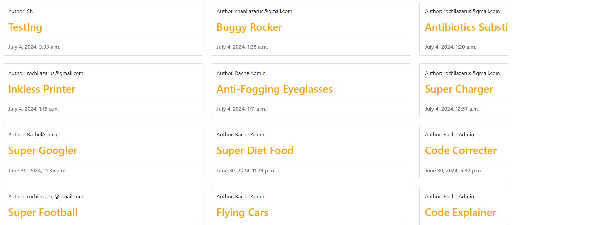
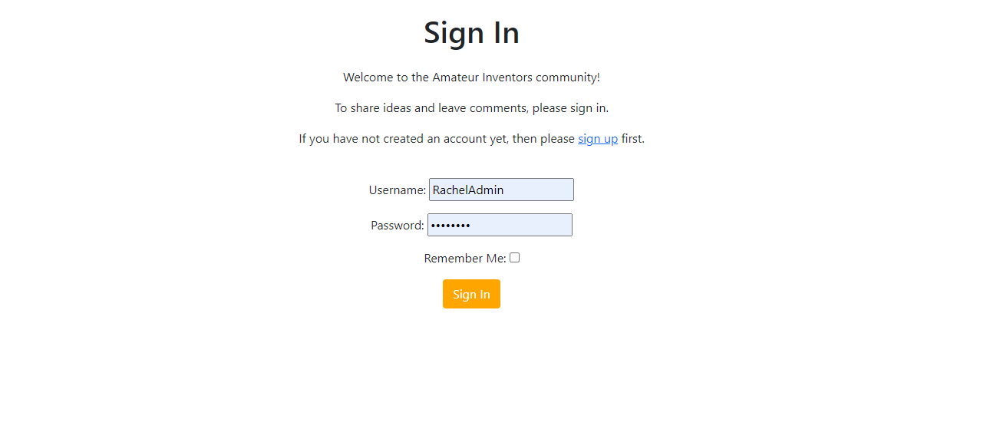
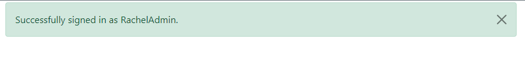
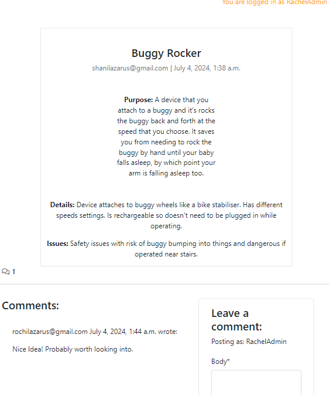
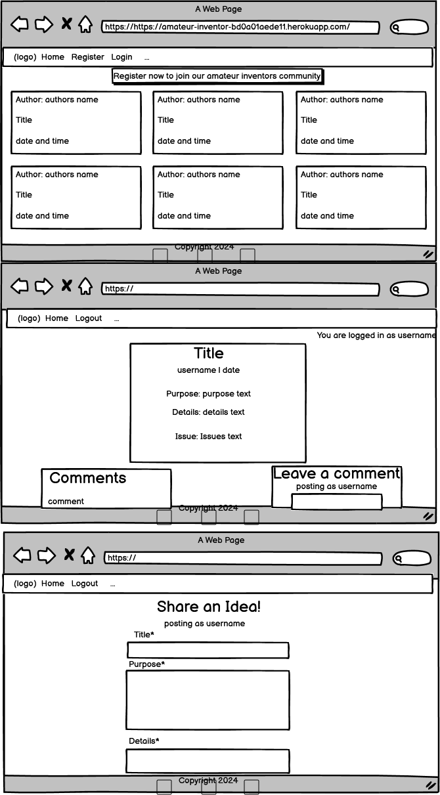

# Amateur Inventors Forum

This website provides a forum for amateur inventors to share their ideas and engage in discussions with other inventors like themselves. Users can create posts detailing their inventive concepts, and other users can offer feedback and suggestions.

Additionally, allowing users to edit and delete their previous posts gives them full control over their content, enabling them to update their ideas based on feedback received or remove outdated posts as needed. This feature fosters a sense of ownership and responsibility among users, encouraging them to actively participate in the platform.

Overall, this website serves as a supportive community for amateur inventors to showcase their ideas, receive valuable input from their peers, and collectively contribute to the growth and development of innovative solutions.

## Features

### Feature name

 - Navbar - Allows for easy navigation of the website. O the landing page directly under the navbar is a button urging users to join the community. This informs users what the purpose of the website is, and allows for a nice user experience as the button takes a user directly to the signup page.

	

- Home page - The home page displays all ideas all users have posted. The user understands intuitively to click on the titles of idea posts, which takes them to a detailed view of the post

	

- Sign in / Sign up pages - The sign in and sign up pages are very easy to use, and the user can easily navigate between the pages.

 

- Verification Messages - The user sees verification messages upon Sign in, Sign out, leaving comments or ideas and editing or deleting comments or ideas.

 

- Idea Detail Page - The user sees a detailed veiw of a post on clicking the title. They can see any comments underneath, and then have an option to leave a comment if logged in.

 

## UX

### Site Goals

- The goal of Amateur Inventors is to provide a forum for aspiring inventors to voice their idea's and initiate discussions or provide feedback on other user's ideas. Users should be able to navigate around the site intuitively and easily. Users should also be able to update or delete any ideas or comments they have posted previously when logged in.

### Wireframes

 

### User Stories

As a user:
- I can create an account, and log in.
- When logged in I can post ideas so that I can get feedback from other users.
- When logged in, I can post comments to give other users feedback and take part in discussions.
- When logged in, I can edit or delete ideas I have posted previously so that I can manage the content I share.
- When logged in, I can edit or delete comments I have previously posted so that i can manage my commments.
- I can click on a post to open a detailed view.
- I can view all ideas posted on my homepage so that i can decide which ones to look at.

### Database Structure

| |Idea| |
|-----------|----------|----------|
||Title|Char Field|
||Slug|SLug Field|
|ForeignKey|Author|User Model|
|           | Purpose| Text|
|           | Mockup image| Cloudinary Field|
|           | Created On| DateTime|
|           | Details| Text|
|           | Issues| Text|
|           | Progress| Integer (choices)|
|           | Updated On| DateTime|

- Cloudinary field - I didn't use this, as I didn't want too many fields, however I left it here in case I do want to add it in at a later stage.
- Progress - I left this out as I felt it was too many fields for a user to fill out.
- Updated on -  I would possibly like to add at a later stage that an idea that was updated shows the updated date as well as the date it was posted originally.

| |Comment| |
|-----------|----------|----------|
|ForeignKey|Idea|Idea Model|
|ForeignKey|Author|User Model|
|           | Body| Text|
|           | created On| DateTime

## Testing

### Validator Testing

- HTML
	- All my code passed when run through the official [W3](https://validator.w3.org/nu/) validator. 
		- Sign up page has some errors caused by the the django allauth package.

- CSS
	- No errors returned from official [Jigsaw](https://jigsaw.w3.org/css-validator/validator?uri=https%3A%2F%2Famateur-inventor-bd0a01aede11.herokuapp.com%2F&profile=css3svg&usermedium=all&warning=1&vextwarning=&lang=en) CSS Validator.

- Python
	- No errors found with [Python](https://pep8ci.herokuapp.com/) validator.
		- In settings.py file, there are some lines that are too long, but they cannot be shortened.

### Unfixed Bugs

 - The form for the user to share an idea wasn't linked properly to Cloudinary, so the images weren't showing. I ultimately decided not to fix that bug, and to take the image option off the form, as I wanted to minimise the number of fields on the form. Additionally, most inventors at this stage won't have a mockup of the invention, so it didn't have much use.

 
 ### Testing user stories

 **Expectation:**
 As a visitor I want to understand the main purpose of the site.

 **Result:**
 As a visitor I understand this is a forum for inventors to share ideas and give feedback.

 **Expectation:**
 As a visitor, I want to be able to navigate around the site easily.

 **Result:**
 As a visitor, the site is very easy to use, and I can navigate around intuitively.

**Expectation:**
As a user, I want to be able to add, update and delete ideas and comments easily.

**Result:**
Adding and making changes to my comments and post is very easy and quick.

###  Manual Testing

|**Feature**|**Expect**|**Action**|**Result**|
|-----------|----------|----------|----------|
|Nav links| They direct the user to the correct page.| Clicked on each nav link on every page.| All nav links led to the correct pages.|
|Share Idea Form| Tells user which fields required, allows to submit when completed. | Tried to submit empty form, partially completed form and completed form| Only allowed to submit when all fields with * were filled in. If missing field, on submit it directs user to the missing field.
|Share Idea Button| On click takes user to share idea form| click share idea button| User was redirected to share idea form page|
|Idea Details| On click of a title of any page, a user is directed to a detailed view of that page.| Click the title of an idea post | User was redirected to the correct blog post indetail, with an option to comment when logged in.
|Edit comment button| Only appears if signed in and the user who wrote the comment | Click on a post and view comments when: 1. Not signed in 2. Signed in as one user 3. signed in as a different user. | When not signed in, a user can view comments, but no edit buttons. When signed in, a edit button is visible for the user for the comment written by them, but not by other users comments.|
|Edit comment button| On click, the form is populated with the comment, and the user can click submit and the comment updates instantly.| Click edit comment button, change comment in form, click submit| On clicking edit button the form populated correctly, the edited comment replaced the old comment once submit was clicked, and a confirmation message appeared.|
|Delete comment button| Only appears if signed in and the user who wrote the comment | Click on a post and view comments when: 1. Not signed in 2. Signed in as one user 3. signed in as a different user. | When not signed in, a user can view comments, but no delete buttons. When signed in, a delete button is visible for the user for the comment written by them, but not by other users comments.|
|Delete comment button| On click, a modal appears for confirmation of delete, on clicking delete the comment dsappears from the screen.| Click delete comment button, click close on modal, click delete button again, click delete on modal| On clicking delete button a modal appeared for confirmation. On clicking close the modal closed and nothing happened. On clicking delete, the comment disappeared from the screen, and a confirmation message appeared.|
|Edit and Delete Idea Buttons| Only appear under an idea when the loggged in user is the author. | Clicked on the idea when not logged in, clicked on the idea I posted previously, and clicked on an idea posted by another user.| When not logged in not buttons appeared underneath posts. When logged in, the buttons were visible underneath ideas I had posted, but not underneath ideas posted by other users.
|Delete Idea Button| When clicked a modal appears with a confirmation message. If close clicked, modal closes and nothing happens. If delete clicked, modal closes, idea and all related comments are deleted, and confirmation message appears. | Click delete under an idea, then click close on modal. Click delete under idea again and this time click delete on modal.| When delete button clicked, a modal appeared. When close clicked, modal closed and nothing happened. Clicked delete again, and this time delete on the modal. The modal closed, idea and related comments deleted, and a confirmation message appeared.|
| Update Idea Button| When clicked a modal appears with the form for an idea, populated with the existing idea.|Click edit button underneath an idea.| Form appears as expected, propopulated with the idea.|
| Update Idea Form | Form fields can be added to or changed, on clicking update, idea updates | Open form by clicking edit, change a few fields, click update| Form updated successfully, a confirmation message appeared, and i was redirected to the home page where i could view the updated idea.|

## Deployment

1. Create an account and login to Heroku.
2. Click create an app.
3. Choose a name for your app, making sure it's available.
4. Install Gunicorn and add to requirements.txt
5. Create a Procfile with 'web: gunicorn [Project name].wsgi'
6. Ensure Debug is set to False, and herokuapp.com is added to allowed hosts in settings.py
7. Add, commit and push your code to github.
8. Click the deploy tab on the Heroku dashboard and choose Github, then choose the correct repository.
9. Click the deploy button.
10. You can now view the app by clicking view app.

## Citation of Sources

- The header and nav bar were partly taken from my [I Think Therefore I Blog ](https://github.com/Rochilaz123/django-blog) Project.
- The comment model and delete modal were mostly taken from [I Think Therefore I blog ](https://github.com/Rochilaz123/django-blog)Project.
- The icons in the header and footer were taken from [Font Awesome](https://fontawesome.com/search?m=free&o=r).

## Future Features

- In the future i would like to implement a feature for each user to create a profile for themselves, and you can click on the author's name to see their profile and a list of all their ideas.
- I would like to add a field on updated posts that tells a user when the post was last updated.